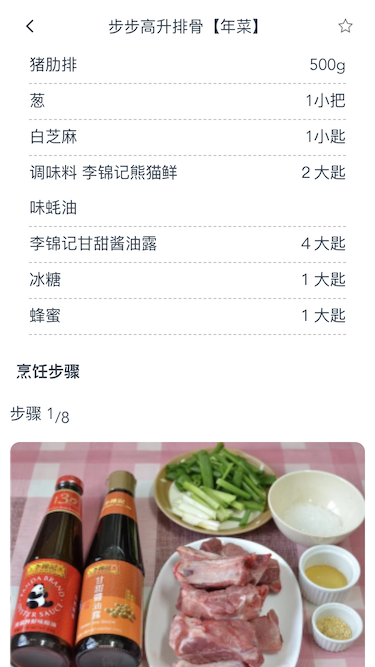

# vue-cookbook

>  基于vue2的菜谱应用,使用vue-cli搭建项目,vue-router做路由管理,
vuex做状态管理,网络请求使用axios.

## 项目演示
>* GitHub地址: [github](https://github.com/Loisme/vue-ecook)

## 项目截图
* 首页


* 推荐菜谱


* 菜谱分类


* 我的


* 分类列表


* 菜谱集合列表


* 菜式详情




* 搜索


## 项目安装
``` bash
# 获取项目
git clone https://github.com/Loisme/vue-ecook.git

# 进入文件夹
cd vue-ecook

# 安装依赖(npm)
npm install

# 开启本地服务器(http://localhost:9090)
npm run dev

# 项目发布
npm run build
```

## 项目结构
***
<pre>
├── build              // 构建服务和webpack配置
├── config             // 项目不同环境的配置
├── dist               // 项目build目录
├── index.html         // 项目入口文件
├── package.json       // 项目配置文件
├── src                // 生产目录
│   ├── assets         // 图片资源
│   ├── common         // 公共的css js 资源
│   ├── components     // 各种组件
│   ├── App.vue        // 主页面 
│   ├── vuex           // vuex状态管理器
│   ├── router.js      // 路由配置器
│   └── main.js        // Webpack 预编译入口
</pre>
